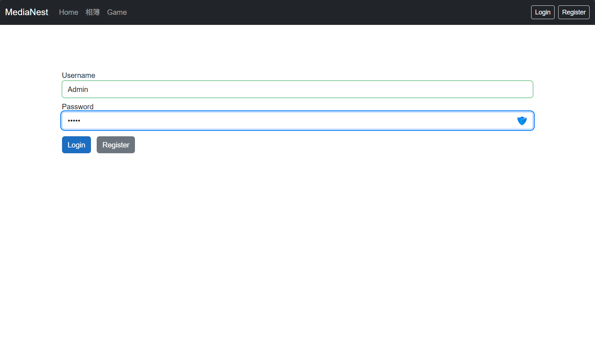
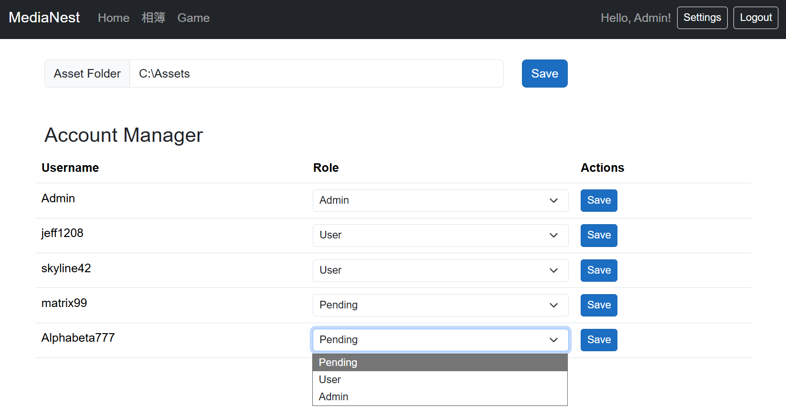
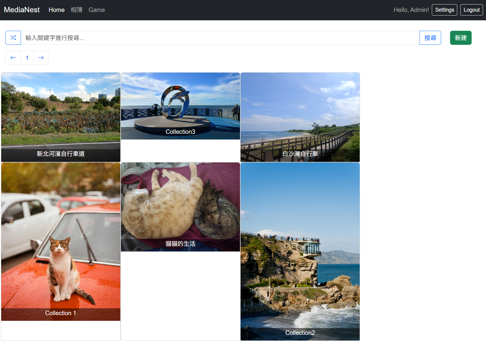
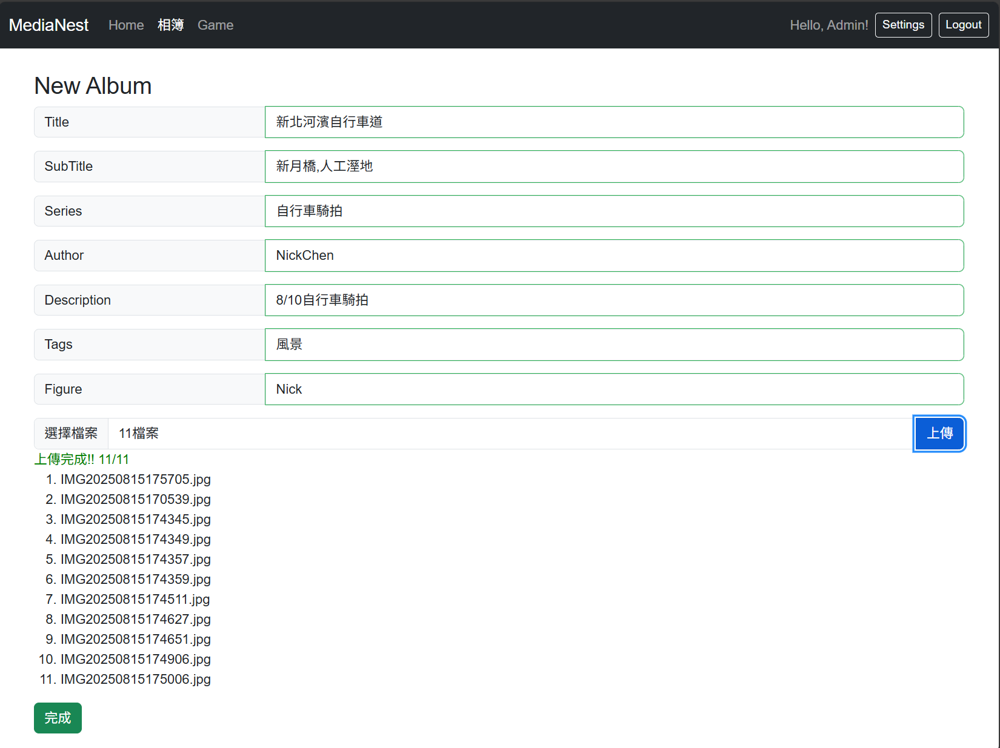
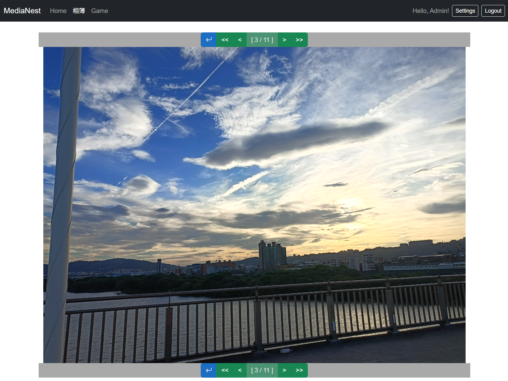
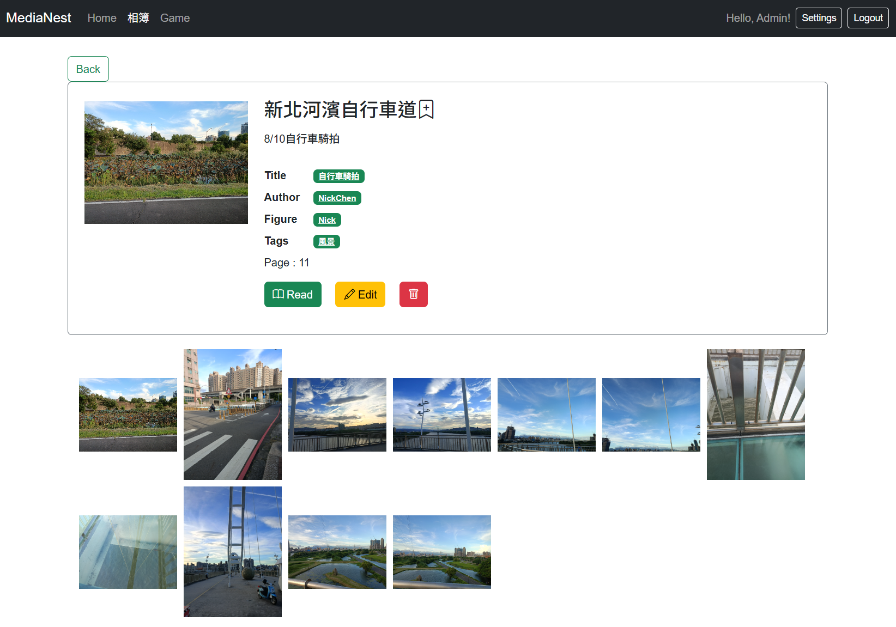

# MediaNest

A web application designed to run as a mini HomeLab host on a family mini PC.
It provides a convenient UI to manage albums, upload and browse images, and handle user access.

## ✨ Features
- 🌄 Album Service
    - Upload images file
    - Tag-based search system
    - Browse image collections with dropdown-view or page-view 

- 🔑 User System
    - Login & Registration
    - Role-based access control
    - Admin Panel for user management, file management

## 🖼️ Screenshots

|  |  |
|------|------|
|  |  |
|  |  |
|  |  |

## 🛠️ Tech Stack

- Aspire (.Net 9)
    - Blazor Server 
    - ASP.NET core WebAPI
- MongoDB (document-based storage for users, albums, metadata)
- Bootstrap 5 (UI components & responsive layout)

## 📋 Prerequisites
Before running the project, make sure you have:

-  .NET 9 Runtime
-  A running MongoDB service

🛳️ Roadmap

- Docker container support (easy deployment)
- Video service (upload & stream videos)